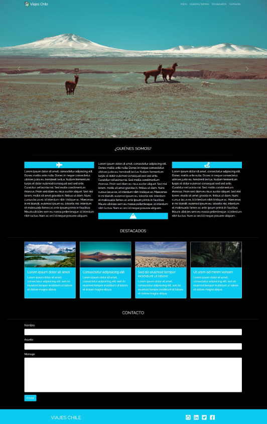

# **LANDING PAGE WITH A TRIPS THEME**

## **Description**
This landing page allows smooth navigation with scroll between sections, displays dynamic content through a carousel, and validates forms interactively. Additionally, it adapts to different devices thanks to its responsive design and leverages advanced Bootstrap and JavaScript components.

## **Technologies Used**
HTML5, CSS3, Bootstrap 5, Bootstrap JS, JavaScript, jQuery

## **Features**
- A fixed navigation bar at the top of the screen, with a logo and links to different sections of the page using smooth scroll.
- A carousel showcasing the site's featured images.
- A presentation section, utilizing favicons and three paragraphs.
- A featured section displaying four cards.
- A contact form section.
- A footer section with links to social media.

## Screenshots
<p align="center">
  
</p>


## Installation
1. Clone the repository
   ```bash
   git clone  https://github.com/yadicep/landing_page_trips.git
